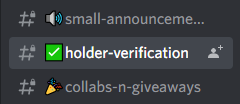
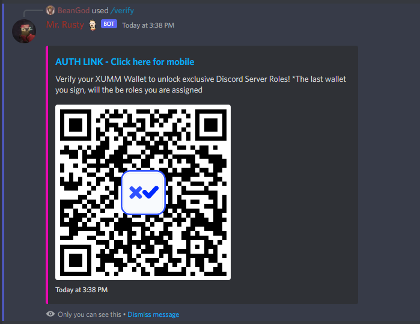
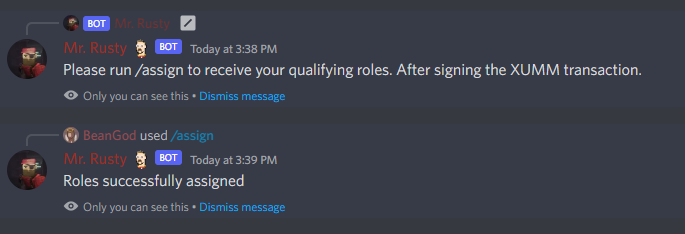

# Junkie Verification Bot

Discord bot that allows members of the junkiverse discord server to verify that they are 
holders of the Junk IOU Tokens. 
This bot verifies the holdings of each member and assigns a role based on how much
Junk they own.

First, server members will find the Holder Verification Channel in the Discord Server

Second, they will run the "/verify" command

Finally, they will run the "/assign" command to receive their roles in the Discord

